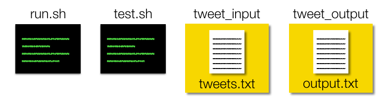

Insight Data Engineering - Coding Challenge
===========================================================

For this coding challenge, you will develop tools that could help analyze the community of Twitter users.  For simplicity, the features we will build are primitive, but you could easily build more complicated features on top of these.   

## Challenge Summary

This challenge requires you to:

Calculate the average degree of a vertex in a Twitter hashtag graph for the last 60 seconds, and update this each time a new tweet appears.

Here, we have to define a few concepts (though there will be examples below to clarify):

- A Twitter hashtag graph is a graph connecting all the hashtags that have been mentioned together in a single tweet.

## Details of Implementation

We'd like you to implement your own version of this.  However, we don't want this challenge to focus on the relatively uninteresting "dev ops" of connecting to the Twitter API, which can be complicated for some users.  Normally, tweets can be obtained through Twitter's API in JSON format, but you may assume that this has already been done and written to a file named `tweets.txt` inside a directory named `tweet_input`.  

(NEED TO CHANGE)For simplicity, this file `tweets.txt` will only contain the actual JSON messages (in reality, the API also can emit messages about the connection and the API rate limits).  Additionally, `tweets.txt` will have the content of each tweet on a newline:

tweets.txt:

	{JSON of first tweet}  
	{JSON of second tweet}  
	{JSON of third tweet}  
	.
	.
	.
	{JSON of last tweet}  

## Implementation Details

You will continually update the Twitter hashtag graph and hence, the average degree of the graph. The graph should just be built using tweets that arrived in the last 60 seconds as compared to the timestamp of the latest tweet. As new tweets come in, edges formed with tweets older than 60 seconds from the timstamp of the latest tweet should be evicted. For each incoming tweet, only extract the following fields in the JSON response
* "hashtags" - hashtags found in the tweet
* "created_at" - timestamp of the tweet

### Building the Twitter Hashtag Graph
Example of 4 tweets

```
Spark Summit East this week! #Spark #Apache (timestamp: Thu Oct 29 
17:51:27 +0000 2015)

So excited to learn about NoSQL databases! #Apache #NoSQL (timestamp: Thu Oct 29 17:51:22 +0000 2015)

Just saw a great post on Insight Data Engineering #Apache #Hadoop #Storm (timestamp: Thu Oct 29 17:51:30 +0000 2015)

Doing great work #Apache (timestamp: Thu Oct 29 17:51:55 +0000 2015)
Excellent post on #Flink and #Spark (timestamp: Thu Oct 29 17:51:56 +0000 2015)
```

Extracted hashtags from each tweet

```
#Spark , #Apache (timestamp: Thu Oct 29 17:51:27 +0000 2015)
#Apache , #NoSQL (timestamp: Thu Oct 29 17:51:22 +0000 2015)
#Apache, #Hadoop, #Storm (timestamp: Thu Oct 29 17:51:30 +0000 2015)
#Apache (timestamp: Thu Oct 29 17:51:55 +0000 2015)
#Flink, #Spark (timestamp: Thu Oct 29 17:51:56 +0000 2015)
```

Note that the the order of the tweets coming in **are not ordered by time**, which mimics what one would get from Twitter's streaming API.  Two hashtags will be connected if and only if they are present in the same tweet. Only tweets that contain two or more **DISTINCT** hashtags can create new edges.

In this case, the first tweet that enters your system has a time-stamp of `7:51:30`.  Take the first tweet's time-stamp **as your initial starting time t0 and any tweets with time-stamp below t0 should be discarded**.  

A good way to create this graph is with an edge list where an edge is defined by two hashtags that are connected. 

The edge list made by all the tweets with time-stamp larger than the initial time is:

```
#Spark <-> #Apache

#Apache <-> #Hadoop
#Hadoop <-> #Storm 
#Storm <-> #Apache

#Flink <-> #Spark
```

Notice that `#Apache <-> #NoSQL` did not generate a new edge since the time stamp is before the first tweet.  Moreover, the third tweet did not generate a new edge since there were no other hashtags besides `#Apache` in that tweet. Also, all tweets occured in the 60 seconds time window as compared to the latest tweet and they all are included in building the graph.

The edge list can be visualized with the following diagrams where each node is a hashtag. The first tweet will generate the `#Spark` and `#Apache` nodes.


The first tweet contains 3 hashtags `#Apache`, `#Hadoop`, and `#Storm`, while the second tweet contains 2 hashtags `#Apache` and `#Spark`, hence the graph for those two tweets looks like


The third tweet generated no edges, so no new nodes will be added to the graph.

The fourth tweet contains `#Flink` and `#Spark`. `#Spark` already exists, so only `#Flink` will be added.


We can now calculate the degree of each node which is defined as the number of connected neighboring nodes.


The average degree for simplicity will be calculated by summing the degrees of all nodes in all graphs and dividing by the total number of nodes in all graphs.

Average Degree = (1+2+3+2+2)/5 = 2.00

The rolling average degree since the 4th tweet is now 
```
2.00
```

### Modifying the Twitter Hashtag Graph with Incoming Tweet
Now let's say another tweet has arrived

```
New and improved #HBase connector for #Spark (timestamp: Thu Oct 29 17:51:59 +0000 2015)
```

The extracted hashtags are then

```
#HBase, #Spark (timestamp: Thu Oct 29 17:51:59 +0000 2015)
```

and added to the edge list

```
#Apache <-> #Hadoop
#Hadoop <-> #Storm
#Storm <-> #Apache

#Spark <-> #Apache

#Flink <-> #Spark

#HBase <-> $Spark
```

The graph now looks like the following


with the updated degree calculation for each node. Here only `#Spark` needs to be incremented due to the additional `#HBase` node.


The average degree will be recalculated using the same formula as before.

Average Degree = (1+3+1+3+2+2)/6 = 2.00

The rolling average degree since the 4th tweet is now 

```
2.00
2.00
```

### Maintaining Data within the 60 Second Window
Now let's say that the next two tweets that come in have the following timestamps

```
New 2.7.1 version update for #Hadoop #Apache (timestamp: Thu Oct 29 17:52:28 +0000 2015)

Looking forward to checking out the updates on Spark GraphX #Spark #GraphX (timestamp: Thu Oct 29 17:51:27 +0000 2015)
```

The full list of tweets now is 

```
Spark Summit East this week! #Spark #Apache (timestamp: Thu Oct 29 17:51:27 +0000 2015)

So excited to learn about NoSQL databases! #Apache #NoSQL (timestamp: Thu Oct 29 17:51:22 +0000 2015)

Just saw a great post on Insight Data Engineering #Apache #Hadoop #Storm (timestamp: Thu Oct 29 17:51:30 +0000 2015)

Doing great work #Apache (timestamp: Thu Oct 29 17:51:55 +0000 2015)

Excellent post on #Flink and #Spark (timestamp: Thu Oct 29 17:51:56 +0000 2015)

New and improved #HBase connector for #Spark (timestamp: Thu Oct 29 17:51:59 +0000 2015)

New 2.7.1 version update for #Hadoop #Apache (timestamp: Thu Oct 29 17:52:28 +0000 2015)

Looking forward to checking out the updates on Spark GraphX #Spark #GraphX (timestamp: Thu Oct 29 17:51:27 +0000 2015)
```

We can see that the second tweet has a timestamp that is more than 60 seconds behind this new tweet. This means that we do not want to include our first tweet in our average degree calculation.  Although `#Spark` and `#GraphX` never appeared prior to the last tweet, we do not form an edge `#Spark <-> #GraphX` since the time-stamp is not in the 2nd time window.

The new hashtags to be used are as follows

```
#Apache, #Hadoop, #Storm (timestamp: Thu Oct 29 17:51:30 +0000 2015)
#Apache (timestamp: Thu Oct 29 17:51:55 +0000 2015)
#Flink, #Spark (timestamp: Thu Oct 29 17:51:56 +0000 2015)
#HBase, #Spark (timestamp: Thu Oct 29 17:51:59 +0000 2015)
#Hadoop #Apache (timestamp: Thu Oct 29 17:52:28 +0000 2015)
```

The new edge list only has the `#Spark` <-> `#Apache` edge removed since `#Hadoop` <-> `#Apache` from the new tweet already exists in the edge list.

```
#Apache <-> #Hadoop
#Hadoop <-> #Storm
#Storm <-> #Apache

#Flink <-> #Spark

#HBase <-> $Spark
```

The old graph has now been disconnected forming two graphs.


We'll then calculate the new degree for all the nodes in both graphs.


Recalculating the average degree of all nodes in all graphs is as follows

```
Average Degree = (1+2+1+2+2+2)/6 = 1.67
```

Normally the average degree is calculated for a single graph, but maintaining multiple graphs for this problem can be quite difficult. For simplicity we are only interested in calculating the average degree of of all the nodes in all graphs despite them being disconnected.

The rolling average degree since the 4th tweet is now 

```
2.00
2.00
1.67
```

The output should be a file in the `tweet_output` directory named `output.txt` that contains the rolling average for each tweet in the file (e.g. if there are three input tweets, then there should be 3 averages), following the format above.  The precision of the average should be two digits after the decimal place (i.e. rounded to the nearest hundredths place).

## Collecting tweets from the Twitter API
Ideally, the updates of the average degree of a Twitter hashtag graph as each tweet arrives would be connected to the Twitter streaming API and would add new tweets to the end of `tweets.txt`.  However, connecting to the API requires more system specific "dev ops" work, which isn't the primary focus for data engineers.  Instead, you should simply assume that each new line of the text file corresponds to a new tweet and design your program to handle a text file with a large number of tweets.  Your program should output the results to a text file named `output.txt` in the `tweet_output` directory.


## Writing clean, scalable, and well-tested code  
As a data engineer, it’s important that you write clean, well-documented code that scales for large amounts of data.  For this reason, it’s important to ensure that your solution works well for a huge number of tweets, rather than just the simple examples above.  For example, your solution should be able to account for a large number of tweets coming in a short period of time, and need to keep up with the input (i.e. need to process a minute of tweets in less than a minute).  It's also important to use software engineering best practices like unit tests, especially since public data is not clean and predictable.  For more details about the implementation, please refer to the FAQ below or email us at cc@insightdataengineering.com

You may write your solution in any mainstream programming language such as C, C++, C#, Clojure, Erlang, Go, Haskell, Java, Python, Ruby, or Scala - then submit a link to a Github repo with your source code.  In addition to the source code, the top-most directory of your repo must include the `tweet_input` and `tweet_output` directories, and a shell script named `run.sh` that compiles and runs the program(s) that implement these features.  If your solution requires additional libraries, environments, or dependencies, you must specify these in your README documentation.  See the figure below for the required structure of the top-most directory in your repo, or simply clone this repo.

## Repo directory structure


Alternatively, here is example output of the `tree` command:

	├── README.md  
	├── run.sh  
	├── src  
	│   ├── average_degree.py    
	├── tweet_input  
	│   └── tweets.txt  
	└── tweet_output  
	    ├── output.txt    

The contents of `src` do not have to contain a single file called "average_degree.py", you are free to include one or more files and name them as you wish.  

## Testing your directory structure and output format
To make sure that your code has the correct directory strucure and the format of the output data in output.txt is correct, we included a test, called `test.sh`.

The output of `test.sh` sould look like:

```
BLAH BLAH
```

If it does not, then an error message will occur indicating that you need to modify your directory or output data structure.  **Your submission must pass these tests in order to pass the coding challenge**.  

## FAQ

Here are some common questions we've received.  If you have additional questions, feel free fork this repo, add them to the README.md, then issue a pull request.  Alternatively, you can email cc@insightdataengineering.com and we'll add the answers as quickly as we can.

* *Which Github link should I submit?*  
You should submit the URL for the top-level root of your repository.  For example, this repo would be submitted by copying the URL `https://github.com/InsightDataScience/cc-example` into the appropriate field on the application.  Please do NOT try to submit your coding challenge using a pull request, which will make your source code publicly available.  

* *Do I need a private Github repo?*  
No, you may use a public repo, there is no need to purchase a private repo.   

* *Do you have any larger sample inputs?*  
Yes, we have just added an example input with 10,000 tweets in the `data-gen` directory of this repo.  It also contains a simplified producer that can connect to the live Twitter API and save the tweets to an input file that conforms to the requirements of this data challenge.  This is not required for this challenge, but may be helpful for testing your solution.  

* *May I use R or other analytics programming languages to solve the challenge?*  
While you may use any programming language to complete the challenge, it's important that your implementation scales to handle large amounts of data.  Many applicants have found that R is unable to process data in a scalable fashion, so it may be more practical to use another language.  

* *May I use distributed technologies like Hadoop or Spark?*  
While you're welcome to use any language or technology, it will be tested on a single machine so there may not be a significant benefit to using these technologies prior to the program.  With that said, learning distributed systems would be a valuable skill for all data engineers.

* *What sort of system should I use to run my program on (Windows, Linux, Mac)?*  
You may write your solution on any system, but your code should be portable and work on all systems.  In particular, your code must be able to run on either Unix or Linux, as that's what the system will be tested on.  This means that you must submit a working `run.sh` script.  Linux machines are the industry standard for most data engineering companies, so it is helpful to be familiar with this.  If you're currently using Windows, we recommend using Cygwin or a free online IDE such as Cloud9 (c9.io).  

* *When are two hashtags considered the same?*  
Hashtags must be the same, but are NOT case-sensitive.  So `#Spark`, `#spark`, and `#SPARK` should all be counted as the same hashtag.  

* *What should I do with tweets that don't have at least two hashtags?*  
These tweets still need to be processed, which may evict older tweets from the 60-second window that affects the graph, but they will not lead to new nodes or edges in the graph.  Tweets with only one hashtag should NOT create nodes.  

* *Can I use pre-built packages, modules, or libraries?*   
Yes, you may use any publicly available package, module, or library as long as you document any dependencies in your accompanying `README` file.  When we review your submission, we will download these libraries and attempt to run your program.   This is why it's very important that you document any dependencies or system specific details in your accompanying README file.  However, you should always ensure that the module you're using works efficiently for the specific use-case in the challenge, many libraries are not designed for large amounts of data.

* *Will you email me if my code doesn't run?*   
Unfortunately, we receive hundreds of submissions in a very short time and are unable to email individuals if code doesn't compile or run.  This is why it's so important to document any dependencies you have, as described in the previous question.  We will do everything we can to properly test your code, but this requires good documentation.  

* *Do I need to use multi-threading?*   
No, your solution doesn't necessarily need to include multi-threading - there are many solutions that don't require multiple threads/cores or any distributed systems.  

* *Do I need to account for and updating `tweets.txt` file?*   
No, your solution doesn't have to re-process `tweets.txt`.  Instead, it should be designed to handle a very large input size.  If you were doing this project as a data engineer in industry, you would probably re-run your program daily to handle batches, but this is beyond the scope of this challenge.  

* *What should the format of the output be?*  
In order to be tested correctly, you must use the format described above.  We will try our best to correct any minor formatting issues, but try to follow the examples above as closely as possible.  

* *What should the precision of the rolling average be?*  
The precision of the average should be two digits after the decimal place (i.e. rounded to the nearest hundredths place).  

* *Do I need to account for complicated Unicode characters by replacing them?*  
No, you simply need to remove them and track how many tweets require this removal.  However, you should replace the non-Unicode escape characters.  

* *What specific class of Unicode should we remove?*  
You should leave all ASCII Unicode characters in the "Basic Latin" category (ranging from 0x0020-0x007F or 32-127 in decimal) and remove all other Unicode.  

* *Should I remove the escape characters or replace them with relevant characters?*  
You should replace the escape characters as follows:  
```  
\/ -> /
\\ -> \
\' -> '
\” -> “
\n -> space
\t -> space
```                                                                                                            
&nbsp;&nbsp;&nbsp;&nbsp;Also, all whitespace escape characters should be replaced with a single space. 

* *Can tweets in the tweets.txt file be out of order?*           						    
No, for simplicity you can assume that the incoming tweets are in order. Although tweets from Twitter API may be out of order sometimes, the testing suite will test your code with all the tweets in order.

* *Will the JSON input contain the hashtag entity, or do I have to extract it from the text?*                                       
You may use the hashtags directly from the entity field of the JSON, or you may extract it from the text.  In either case, you will need to make the hashtags have been "cleaned" as described in feature 1.  

* *Can hashtags contain unicode characters and how should these be handled?*                                       
Yes, hashtags can contain unicode characters. You should clean hashtags in feature 2 the same way you clean a tweet in feature 1.

* *Do I need to account for empty tweets?*  
No, for simplicity you may assume that all the tweets contain at least one word.  However, many tweets contain only unicode chracters, which will be effectively empty after you clean them.  This means you will have to test properly when implementing on real data.   

* *Do I need to account for JSON messages that looks like {"limit": {"track":5,"timestamp_ms":"1446218985743"} }, which appear in the example from the data generator?*  
No, these are simply artifacts from the Twitter API that result from the rate-limit.  Our testing suite will not contain these messages, and they can be ignored.   

* *Should my graph from feature 2 contain disconnected nodes?*                                       
No, the graph should only contain connected nodes, and this also means that you may need to remove nodes if they are no longer connected in the last 60 seconds.  

* *Should I check if the files in the input directory are text files or non-text files(binary)?*  
No, for simplicity you may assume that all of the files in the input directory are standard text files.  

* *What should the average be if the graph has no connections (e.g. if the first tweet doesn't have at least two hashtags)?*  
If there are no connections for the entire graph, then you can count the average as 0.  

* *Should I count self connections if a hashtag appears multiple times in a tweet?*  
No, for simplicity you should not count connection from a node to itself.  

* *Do I need separate programs for different features?*  
You may use a single combined program or several programs, as long as they are all executed by the `run.sh` script.

* *Can I use an IDE like Eclipse to write my program?*  
Yes, you can use what ever tools you want -  as long as your `run.sh` script correctly runs the relevant target files and creates the `output.txt` file in the `tweet_output` directory.

* *What should be in the `tweet_input` directory?*  
You can put any text file you want in the directory.  In fact, this could be quite helpful for testing your solutions.

* *How will the coding challenge be evaluated?*  
Generally, we will evaluate your coding challenge with a testing suite that provides a variety of input tweets and checks the corresponding output.  This suite will attempt to use your 'run.sh' and is fairly tolerant to different runtime environments.  Of course, there are many aspects that cannot be tested by our suite, so each submission will be reviewed manually by a person as well. 

* *How long will it take for me to hear back from you about my submission?*  
We receive hundreds of submissions and try to evaluate them all in a timely manner.  We try to get back to all applicants within two or three weeks of submission, but if you have a specific deadline that requires expedited review, you may email us at cc@insightdataengineering.com.  
